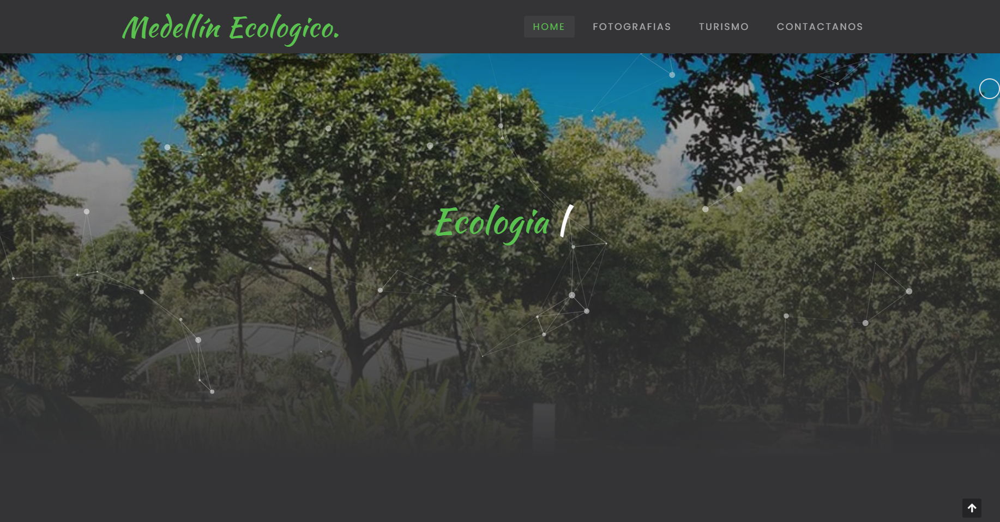

## Descripción

El sitio web presenta información sobre diferentes lugares turísticos en Medellín que están relacionados con la ecología, como parques naturales, museos y áreas naturales protegidas. También incluye fotografías y testimonios de visitantes.

## Tecnologías utilizadas

El sitio web está desarrollado utilizando las siguientes tecnologías:

- HTML
- CSS
- Bootstrap
- JavaScript
- jQuery

## Instalación

Para ejecutar el proyecto localmente, sigue estos pasos:

1. Clona el repositorio en tu máquina local.
2. Abre el archivo `index.html` en tu navegador web.

¡Esperamos que disfrutes del sitio web de Medellín Ecologico!
